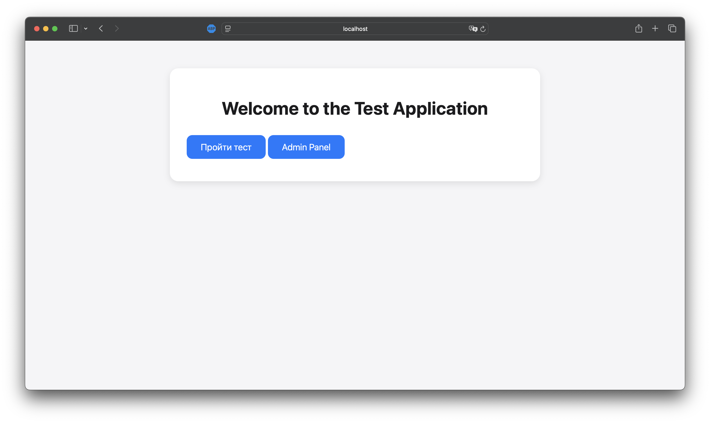
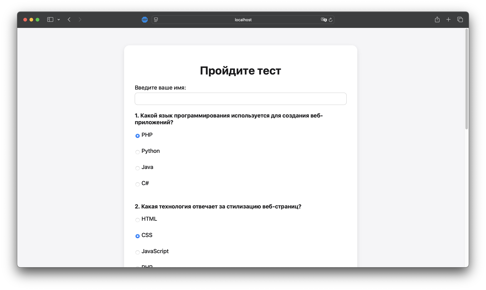
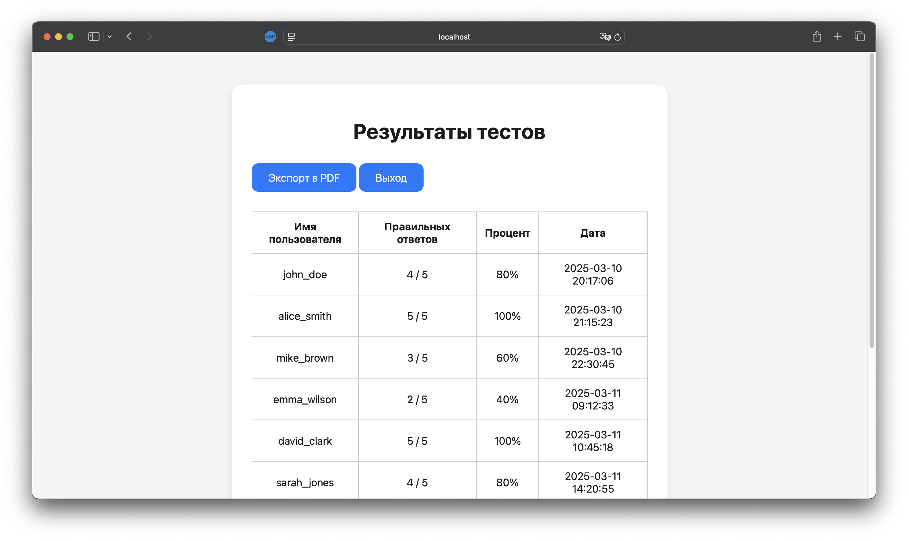
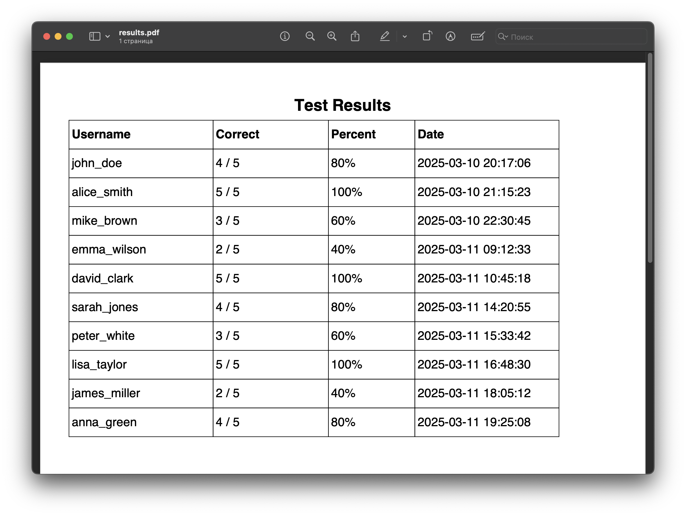

# Аттестационная работа: Веб-приложение для тестов

---

<details>
<summary>📋 Содержание</summary>

- [Описание проекта](#описание-проекта)  
- [Использованные технологии](#использованные-технологии)  
- [Файловая структура](#файловая-структура)  
- [Функциональность](#функциональность)  
- [Подробности реализации](#подробности-реализации)  
  - [Классы и их назначение](#классы-и-их-назначение)  
  - [Валидируемые данные](#валидируемые-данные)  
- [Инструкции по запуску](#инструкции-по-запуску)  
- [Примеры тестов](#примеры-тестов)  
- [Структура базы данных/файлов](#структура-базы-данныхфайлов)  
- [Скриншоты работы приложения](#скриншоты-работы-приложения)  
- [Заключение](#заключение)  

</details>

---

## Описание проекта

✨ **Данное веб-приложение** создано на PHP и представляет собой систему для:  
- **Создания и прохождения тестов** (анонимно).  
- **Сохранения и отображения результатов** в стильном и удобном виде.  
- **Экспорта результатов** в PDF одним кликом.  

### Требования, которые я выполнил:  
1. Тесты включают вопросы с **одним правильным ответом (radio)** и **несколькими правильными (checkbox)**.  
2. Пользователи проходят тест анонимно, указав только имя.  
3. Админ-панель с таблицей результатов доступна после авторизации.  
4. Все данные (вопросы, результаты) хранятся в **JSON-файлах** — просто и эффективно.  

---

## Использованные технологии

🔧 **Технологический стек, который я задействовал:**  
- **PHP 8+** — серверная магия для всей логики.  
- **HTML/CSS** — стильный фронтенд для пользователей.  
- **FPDF** — библиотека для генерации PDF-отчётов.  
- **JSON** — лёгкое и удобное хранилище вопросов и результатов.  

---

## Файловая структура

📂 **Структура проекта в виде дерева:**  

```
/project_root/
├── index.php             # Главная страница (главное меню)
├── admin_login.php       # Форма авторизации в админ-панель
├── dashboard.php         # Админ-панель: список всех результатов
├── export_pdf.php        # Экспорт результатов теста в PDF
├── logout.php            # Скрипт выхода из админ-панели
├── result.php            # Отображение индивидуального результата
├── test.php              # Форма и логика прохождения теста
├── style.css             # Файл стилей (оформление iOS/Telegram Style)
├── includes/             # Папка с классами
│   ├── DataManager.php   # Класс для работы с файлами вопросов и результатов
│   └── TestEvaluator.php # Класс для оценки результатов теста
├── questions.json        # JSON-файл с вопросами теста
├── results.json          # JSON-файл с результатами тестов
└── README.md             # Этот стильный отчёт
```

### Кратко о каждом файле:  
- **`index.php`**: Главный экран с приветствием. Отсюда — путь к тесту или админке.  
- **`admin_login.php`**: Форма логина для админа. Вход — в `dashboard.php`.  
- **`dashboard.php`**: Админ-панель с таблицей результатов, кнопками экспорта и выхода.  
- **`export_pdf.php`**: Генерация PDF с результатами (только для админов).  
- **`logout.php`**: Выход из админки с очисткой сессии.  
- **`result.php`**: Показывает результат пользователя после теста.  
- **`test.php`**: Сердце теста — вопросы, валидация, подсчёт, редирект.  
- **`includes/DataManager.php`**: Класс для работы с JSON-файлами.  
- **`includes/TestEvaluator.php`**: Класс для оценки ответов.  
- **`questions.json`**: Вопросы теста (5+ штук, single/multiple).  
- **`results.json`**: Хранит результаты в формате:  
  ```json
  {
    "username": "имя",
    "score": 80,
    "correct_answers": 4,
    "total": 5,
    "date": "YYYY-MM-DD HH:MM:SS"
  }
  ```  
- **`style.css`**: Минималистичный дизайн в стиле iOS — закругления, чистота, эстетика.  

---

## Функциональность

🚀 **Что умеет это приложение:**  

1. **Анонимное прохождение теста**:  
   - Ввод имени в начале.  
   - Вопросы: `radio` (один ответ) или `checkbox` (несколько).  

2. **Валидация данных**:  
   - Имя чистится через `filter_input()` и `trim()`.  
   - Ответы проверяются:  
     - `single`: один из допустимых вариантов.  
     - `multiple`: массив, все элементы — из допустимых.  
   - Ошибка? Пользователь увидит сообщение.  

3. **Подсчёт результатов**:  
   - Класс `TestEvaluator` считает правильные ответы и процент.  

4. **Сохранение результатов**:  
   - Данные (имя, дата, процент, правильные ответы) пишутся в `results.json`.  

5. **Отображение результатов**:  
   - Личный результат — на `result.php`.  
   - Все результаты — в админке на `dashboard.php`.  

6. **Экспорт в PDF**:  
   - Админ скачивает PDF через `export_pdf.php`.  

7. **Защищённая админка**:  
   - Логин: `admin`, пароль: `123456` (хардкод).  
   - Сессия через `$_SESSION['admin']`.  

---

## Подробности реализации

### Классы и их назначение  

#### 1. `DataManager` (`includes/DataManager.php`)  
- **`loadQuestions()`**: Читает и парсит `questions.json`.  
- **`loadResults()`**: Читает `results.json`, создаёт пустой файл, если его нет.  
- **`saveResult(array $result)`**: Добавляет запись в `results.json`.  

#### 2. `TestEvaluator` (`includes/TestEvaluator.php`)  
- **`evaluate(array $questions, array $answers)`**: Сравнивает ответы с правильными, возвращает количество верных и процент.  

### Валидируемые данные  
- **Имя**:  
  - Не пустое.  
  - Очищается через `filter_input()` и `trim()`.  
- **Ответы**:  
  - Соответствие типу вопроса (`single`/`multiple`).  
  - Для `single`: один вариант из списка.  
  - Для `multiple`: массив, все элементы — из допустимых.  

---

## Инструкции по запуску

🛠 **Как запустить проект:**  

1. **Склонировать репозиторий**:  
   ```bash
   git clone <URL репозитория>
   ```  

2. **Разместить на сервере**:  
   - Нужен PHP 8+.  
   - Локально: MAMP, XAMPP или `php -S localhost:8000`.  

3. **Установить FPDF**:  
   - Скачать с [официального сайта](http://www.fpdf.org/).  
   - Поместить в `/fpdf/` в корне проекта.  
   - Проверить путь в `export_pdf.php`:  
     ```php
     require_once 'fpdf/fpdf.php';
     ```  

4. **Права на запись**:  
   - Убедитесь, что `results.json` доступен для записи.  
   - Если файла нет, `DataManager` его создаст.  

5. **Открыть в браузере**:  
   - Главная: `http://localhost/path_to_project/index.php`  
   - Админка: `http://localhost/path_to_project/admin_login.php`  
     - Логин: `admin`, пароль: `123456`.  

---

## Примеры тестов

📝 **Пример `questions.json`:**  

```json
{
  "questions": [
    {
      "text": "Какой язык программирования используется для создания веб-приложений?",
      "type": "single",
      "options": [
        { "text": "PHP", "correct": true },
        { "text": "Python", "correct": false },
        { "text": "Java", "correct": false },
        { "text": "C#", "correct": false }
      ]
    },
    {
      "text": "Какая технология отвечает за стилизацию веб-страниц?",
      "type": "single",
      "options": [
        { "text": "HTML", "correct": false },
        { "text": "CSS", "correct": true },
        { "text": "JavaScript", "correct": false },
        { "text": "PHP", "correct": false }
      ]
    },
    {
      "text": "Выберите языки программирования:",
      "type": "multiple",
      "options": [
        { "text": "PHP", "correct": true },
        { "text": "JavaScript", "correct": true },
        { "text": "HTML", "correct": false },
        { "text": "CSS", "correct": false }
      ]
    },
    {
      "text": "Какой протокол используется для передачи данных в интернете?",
      "type": "single",
      "options": [
        { "text": "FTP", "correct": false },
        { "text": "HTTP", "correct": true },
        { "text": "SMTP", "correct": false },
        { "text": "POP3", "correct": false }
      ]
    },
    {
      "text": "Выберите инструменты для контроля версий:",
      "type": "multiple",
      "options": [
        { "text": "Git", "correct": true },
        { "text": "SVN", "correct": true },
        { "text": "Docker", "correct": false },
        { "text": "Jenkins", "correct": false }
      ]
    }
  ]
}
```

---

## Структура базы данных/файлов

📊 **Формат данных:**  

- **`questions.json` (пример):**  
  ```json
  {
    "questions": [
      {
        "text": "Вопрос...",
        "type": "single",
        "options": [
          { "text": "Ответ А", "correct": false },
          { "text": "Ответ B", "correct": true }
        ]
      }
    ]
  }
  ```  

- **`results.json` (пример):**  
  ```json
  {
    "results": [
      {
        "username": "Mike",
        "score": 80,
        "correct_answers": 4,
        "total": 5,
        "date": "2025-03-10 10:00:00"
      }
    ]
  }
  ```  

### Поля в `results.json`:  
| Поле            | Тип         | Описание                     |  
|-----------------|-------------|------------------------------|  
| `username`      | Строка      | Имя пользователя            |  
| `score`         | Целое число | Процент правильных ответов  |  
| `correct_answers`| Целое число | Кол-во правильных ответов  |  
| `total`         | Целое число | Общее кол-во вопросов      |  
| `date`          | Строка      | Дата/время (Y-m-d H:i:s)   |  

---

## Скриншоты работы приложения

📸 **Примеры интерфейса (заглушки):**  

| Главная страница         | Форма теста              |  
|--------------------------|--------------------------|  
|  |  |  

| Админ-панель             | Экспорт PDF            |  
|--------------------------|--------------------------|  
|  |  |   

---

## Заключение

🎉 **Итог:** Этот проект — реализация задания:  
1. Анонимное прохождение с вводом имени.  
2. Два типа вопросов: `single` (radio) и `multiple` (checkbox).  
3. 5+ вопросов в тесте (гибко настраиваемо).  
4. Полная серверная валидация (имя, ответы).  
5. Хранение в JSON — без лишних БД.  
6. Защищённая админка с авторизацией.  
7. Экспорт в PDF через FPDF.  
8. Подробная документация.  

✓ Проект полностью реализован в соответствии с техническим заданием, следуя принципам минимализма и эффективности в дизайне и архитектуре. Система готова к внедрению и дальнейшему масштабированию.  

--- 

**Конец отчёта.**