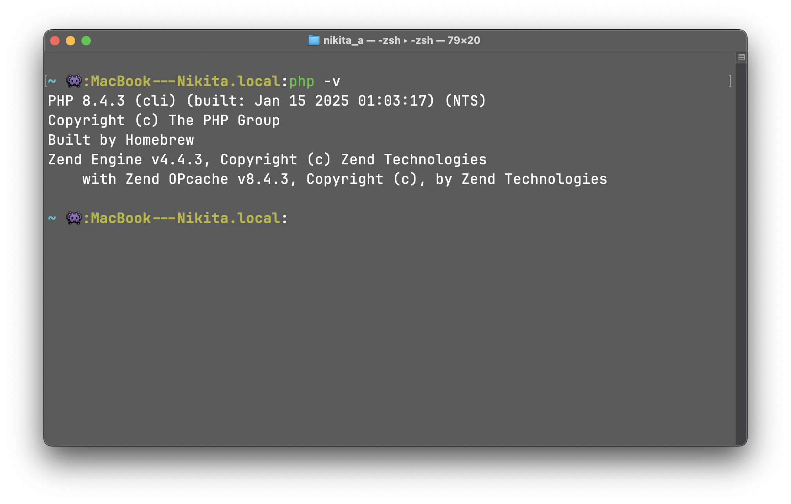
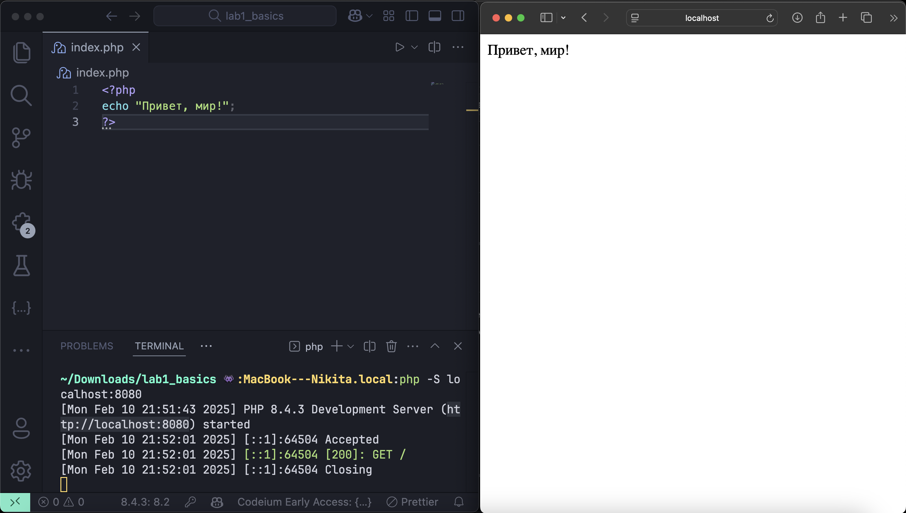
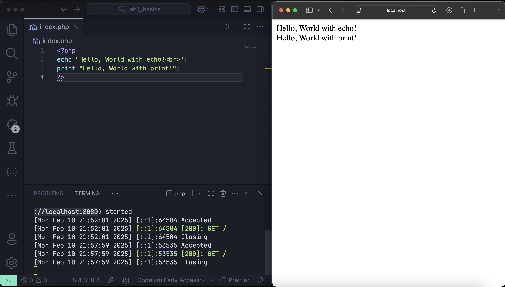
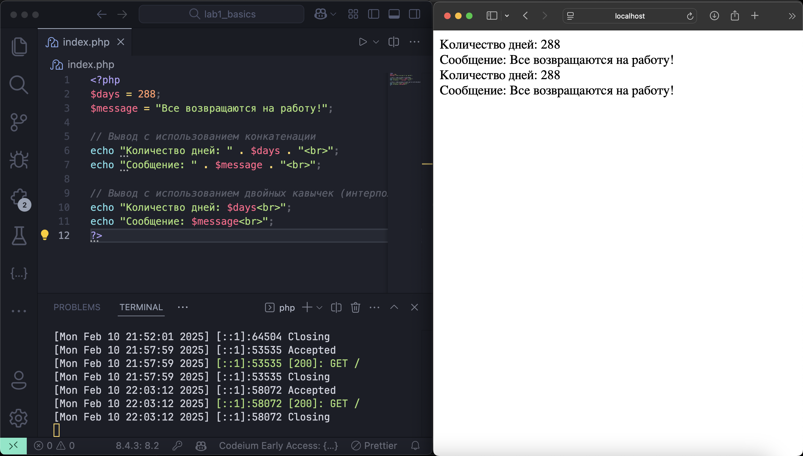

# Лабораторная работа №1: Установка и первая программа на PHP

## Установка первой программы на PHP

**Лабораторная работа №1**

---

## Цель работы

Цель данной лабораторной работы заключается в установке и настройке среды разработки для работы с языком программирования PHP, а также в создании первой программы на PHP. В процессе выполнения работы мы научимся:

- Устанавливать PHP (как напрямую, так и через XAMPP, для Mac OS через менеджер пакетов Homebrew).
- Настраивать переменные среды для корректной работы PHP.
- Создавать и запускать простейшие PHP-скрипты.
- Использовать функции для вывода данных и работать с переменными.

---

## Условия

В рамках лабораторной работы необходимо выполнить следующие шаги:

1. **Установка PHP**  
   - Скачивание актуальной версии PHP с официального сайта: [PHP Downloads](https://www.php.net/downloads).  
   - Распаковка архива в удобное место (например, `C:\Program Files\php`).  
   - Добавление пути к PHP в системную переменную **Path**.  
   - Проверка установки командой `php -v`.

2. **Альтернативный способ установки PHP**  
   (Выбрать один из двух способов установки.)  
   - Установка XAMPP: скачивание с сайта [Apache Friends](https://www.apachefriends.org) с выбором компонентов Apache, PHP и phpMyAdmin.  
   - Запуск XAMPP Control Panel и активация Apache.  
   - Проверка работы сервера через браузер по адресу [http://localhost](http://localhost).

3. **Написание первой PHP-программы**  
   - Создание директории для проекта (например, `D:\Projects\PHP\01_Introduction`).  
   - Создание файла `index.php` с кодом для вывода простого сообщения.

4. **Вывод данных в PHP**  
   - Вывод строк "Hello, World with echo!" и "Hello, World with print!" с использованием функций `echo` и `print`.

5. **Работа с переменными и выводом**  
   - Объявление двух переменных: целочисленной переменной `$days` со значением `288` и строковой переменной `$message` с текстом `"Все возвращаются на работу!"`.  
   - Вывод значений переменных с использованием конкатенации (оператор `.`) и интерполяции (двойные кавычки), а также применение HTML-тега `<br>` для перехода на новую строку.

---

## Детальное описание шагов выполнения лабораторной работы

В данном разделе я подробно описываю все шаги, которые я выполнил для установки PHP, настройки среды и создания первой программы на PHP в системе Mac OS, с подробными пояснениями и примерами команд, которые я вводил в терминале.

### Шаг 1: Установка PHP через Homebrew на Mac OS

#### 1.1 Обновление Homebrew

Я открыл терминал и выполнил следующую команду для обновления менеджера пакетов Homebrew:

```bash
brew update
```
Эта команда проверяет наличие обновлений Homebrew и обновляет его, если необходимо.

#### 1.2 Установка PHP

После обновления Homebrew я установил PHP, выполнив команду:

```bash
brew install php
```
Homebrew автоматически скачал и установил последнюю стабильную версию PHP.

#### 1.3 Проверка установки PHP
Чтобы убедиться, что PHP установлен корректно, я ввёл команду:
```bash
php -v
```


### Шаг 2: Запуск встроенного веб-сервера PHP

Так как я работаю на Mac OS и установил PHP через Homebrew, я воспользовался встроенным веб-сервером PHP для тестирования моих программ.

#### 2.1 Запуск сервера в директории проекта

Я перехожу в директорию моего проекта:
```bash
cd ~/Projects/PHP/MyScripts
```

Затем я запускаю встроенный сервер командой:
```bash
php -S localhost:8080
```

Эта команда поднимает сервер на localhost с портом 8080. После этого я открываю браузер и перехожу по адресу http://localhost:8080 для проверки работы моих PHP-скриптов.

### Шаг 3: Написание первой PHP-программы

#### 3.1 Создание директории проекта

Я создаю директорию для моего проекта с помощью команды:
```bash
mkdir -p ~/Projects/PHP/lab1_basics
cd ~/Projects/PHP/lab1_basics
```

#### 3.2 Создание файла программы

Я открываю Visual Studio Code и создаю новый файл с именем index.php в директории моего проекта через команду:

```bash
touch index.php
```

#### 3.3 Написание кода

В файле index.php я ввожу следующий код:

```php
<?php
echo "Привет, мир!";
?>
```
Этот скрипт выводит на экран сообщение «Привет, мир!».

#### 3.4 Проверка работы программы

После сохранения файла я запускаю сервер (как описано в шаге 2) и открываю браузер по адресу http://localhost:8080. На экране отображается сообщение «Привет, мир!», что подтверждает корректное выполнение программы.



### Шаг 4: Вывод данных в PHP

На этом шаге я демонстрирую вывод данных с помощью функций ```echo``` и ```print```.

#### 4.1 Редактирование файла для вывода данных

Я редактирую файл index.php и ввожу следующий код:

```php
<?php
echo "Hello, World with echo!<br>";
print "Hello, World with print!";
?>
```
- Функция echo выводит строку с HTML-тегом <br>, который обеспечивает перенос строки.
- Функция print также выводит строку, где <br> используется для создания разрыва строки.

#### 4.2 Проверка результата

Запустив сервер и обновив страницу в браузере, я убеждаюсь, что обе строки выводятся корректно.



### Шаг 5: Работа с переменными и выводом

В этом шаге я демонстрирую создание переменных и вывод их значений различными способами.

#### 5.1 Объявление переменных

Я объявляю две переменные:
- Целочисленную переменную ```$days``` со значением 288.
- Строковую переменную ```$message``` со значением "Все возвращаются на работу!".

#### 5.2 Написание кода для вывода переменных

Я добавляю следующий код в мой PHP-скрипт:


```php
<?php
$days = 288;
$message = "Все возвращаются на работу!";

// Вывод с использованием конкатенации
echo "Количество дней: " . $days . "<br>";
echo "Сообщение: " . $message . "<br>";

// Вывод с использованием двойных кавычек (интерполяция)
echo "Количество дней: $days<br>";
echo "Сообщение: $message<br>";
?>
```
- При использовании оператора конкатенации (.) строки и переменные объединяются в единое целое.
- При использовании двойных кавычек PHP автоматически подставляет значения переменных в строку.

#### 5.3 Проверка результата

После запуска сервера и обновления страницы в браузере, я вижу корректный вывод значений переменных.




## Заключение

В ходе выполнения лабораторной работы я:
- **Установил PHP через Homebrew** на Mac OS, обновив Homebrew и установив PHP командой brew install php.
- **Запустил встроенный веб-сервер PHP** с помощью команды ```php -S localhost:8080``` (с примерами запуска в разных директориях).
- **Создал первую PHP-программу:** создал директорию проекта, файл index.php в Visual Studio Code и написал код для вывода сообщения «Привет, мир!».
- **Продемонстрировал вывод данных** с помощью функций ```echo``` и ```print```.
- **Работал с переменными**, выводя их значения с использованием конкатенации и интерполяции.


# Контрольные вопросы

### 1. Какие способы установки PHP существуют?

1. Установка PHP на Windows
- Ручная установка (загрузка архива с официального сайта и настройка переменных среды).
- XAMPP (пакет с Apache, MySQL и PHP).
- Chocolatey (установка через пакетный менеджер Chocolatey).

2. Установка PHP на macOS
- Homebrew (рекомендуемый способ, автоматическая установка и обновление).
- MAMP (аналог XAMPP для macOS, включает сервер и MySQL).
- Ручная установка (скачивание архива и настройка вручную).

3. Установка PHP на Linux
- APT (Debian, Ubuntu) – ```sudo apt install php```.
- YUM/DNF (CentOS, Fedora, RHEL) – ```sudo yum install php``` / ```sudo dnf install php```.
- Pacman (Arch Linux) – ```sudo pacman -S php```.
- Compiling from source – ручная компиляция PHP из исходного кода.

4. Установка в Docker
PHP можно запустить в контейнере, используя официальный образ:
```bash
docker run -d --name my-php-container php:latest
```

### 2. Как проверить, что PHP установлен и работает?

- Чтобы проверить, установлен ли PHP, можно выполнить несколько действий. В терминале можно ввести команду ```php -v```, если команда не найдена, значит PHP не установлен либо не добавлен в переменные среды. 
- Также можно проверить через встроенный PHP-сервер, запустив его командой ```php -S localhost:8080```, затем открыть браузер и перейти по адресу http://localhost:8080. Если сервер запущен, значит PHP работает. 
- Ещё один способ — создать файл info.php в корневой директории сервера и добавить в него код ```<?php phpinfo(); ?>```, затем открыть http://localhost/info.php в браузере. Если страница с настройками PHP отображается, значит он работает корректно. 
- На Linux или macOS можно использовать команду ```which php```, если она выдаст путь к бинарному файлу, например ```/usr/bin/php```, значит PHP установлен. Если путь не найден, значит PHP либо не установлен, либо не добавлен в PATH.

### 3. Чем отличается оператор ```echo``` от ```print```?

Операторы ```echo``` и ```print``` в PHP используются для вывода данных, но между ними есть несколько отличий:
1.	Возвращаемое значение
- echo не возвращает значение, просто выводит данные.
- print возвращает 1, поэтому его можно использовать в выражениях.
2.	Скорость выполнения
- echo работает немного быстрее, так как не возвращает значение.
- print медленнее, потому что возвращает 1, что требует дополнительных операций.
3.	Синтаксис
- echo может выводить несколько аргументов, разделённых запятыми:
```
echo "Hello", " World", "!";
```

- print принимает только один аргумент:
```
print "Hello World!";
```

4.	Использование в выражениях
- Так как print возвращает 1, его можно использовать в выражениях:
```
$result = print "Hello"; // $result будет 1
```

- echo не может быть использован таким образом.

Вывод:

Если нужно просто вывести текст, лучше использовать echo, так как он быстрее. Если же требуется вернуть значение, можно использовать print.