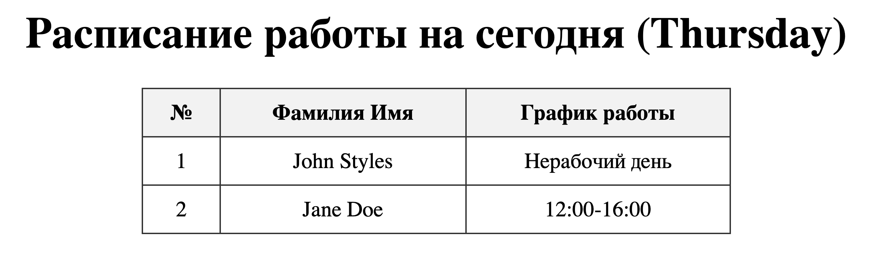
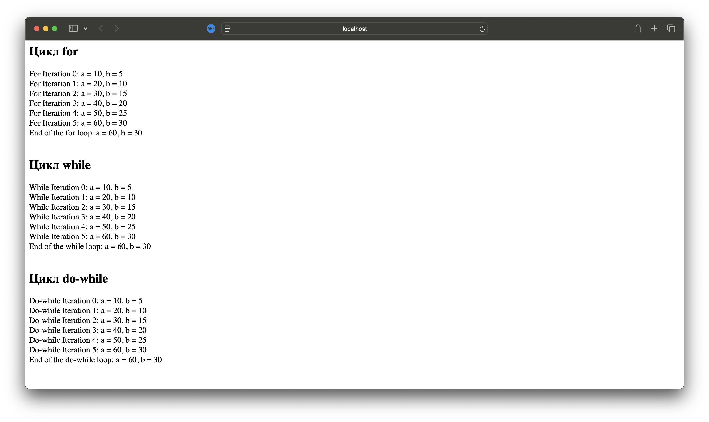

# Лабораторная работа №2: Управляющие конструкции

---

## 🎯 Тема
Управляющие конструкции в PHP

---

## 📝 Цель работы
- Освоить использование условных конструкций (if, else) для решения практических задач.
- Научиться работать с циклами (`for`, `while`, `do-while`) и выводить промежуточные результаты.
- Понять разницу между различными типами циклов и тернарным оператором в PHP.

---

## 📚 Условия работы

### 1. Условные конструкции
Используя функцию `date()`, создайте таблицу с расписанием, формируемым на основе текущего дня недели, для двух сотрудников:

| № | Фамилия Имя   | График работы    |
|---|---------------|------------------|
| 1 | John Styles   | xx - xx          |
| 2 | Jane Doe      | yy - yy          |

#### Для John Styles (xx - xx):
- Если текущий день недели — **понедельник, среда или пятница**, выведите график работы: **8:00-12:00**.
- В остальные дни недели выведите текст: **Нерабочий день**.

#### Для Jane Doe (yy - yy):
- Если текущий день недели — **вторник, четверг или суббота**, выведите график работы: **12:00-16:00**.
- В остальные дни недели выведите текст: **Нерабочий день**.

---

### 2. Циклы

Создайте файл `index.php` со следующим кодом:

```php
<?php

$a = 0;
$b = 0;

for ($i = 0; $i <= 5; $i++) {
   $a += 10;
   $b += 5;
}

echo "End of the loop: a = $a, b = $b";
```
Задание:
- Доработать цикл for, добавив вывод промежуточных значений переменных $a и $b на каждом шаге цикла.
- Переписать этот цикл с использованием операторов while и do-while.

---

## Детальное описание шагов выполнения лабораторной работы

В этой лабораторной работе я выполню несколько этапов, чтобы разобраться с условными конструкциями и циклами в PHP. Ниже приведено подробное описание каждого шага.

## 1. Условные конструкции

### Шаг 1.1: Получение текущего дня недели
- **Что я делаю:**  
  Я буду использовать функцию `date('l')` для получения полного названия текущего дня недели (например, "Monday", "Tuesday", и т.д.).
- **Зачем:**  
  Это необходимо для определения, какой график работы выводить для сотрудников.

### Шаг 1.2: Определение графика работы для сотрудников
- **Для John Styles:**  
  - **Условие:** Если текущий день — понедельник, среда или пятница.
  - **Действие:** Я выведу график работы "8:00-12:00".
  - **В противном случае:** Выведу "Нерабочий день".
- **Для Jane Doe:**  
  - **Условие:** Если текущий день — вторник, четверг или суббота.
  - **Действие:** Выведу график работы "12:00-16:00".
  - **В противном случае:** Выведу "Нерабочий день".

### Шаг 1.3: Формирование и вывод таблицы
- **Что я делаю:**  
  Я создам HTML-таблицу с тремя колонками: номер, Фамилия Имя, График работы.
- **Как:**  
  Используя PHP, я сгенерирую таблицу, где в строках будут выводиться данные для John Styles и Jane Doe, а график работы будет определяться на основе текущего дня недели.
- **Код для вывода таблицы:**
  ```php
  echo "<table border='1'>
          <tr>
            <th>№</th>
            <th>Фамилия Имя</th>
            <th>График работы</th>
          </tr>
          <tr>
            <td>1</td>
            <td>John Styles</td>
            <td>$johnSchedule</td>
          </tr>
          <tr>
            <td>2</td>
            <td>Jane Doe</td>
            <td>$janeSchedule</td>
          </tr>
        </table>";
  ```

Здесь переменные $johnSchedule и $janeSchedule будут установлены с помощью условных операторов.

### Шаг 1.4: Файл задания

- **Имя файла:** `schedule.php`  

---

### Шаг 1.5: Пошаговое описание реализации

1. **Определение текущего дня недели**  
   - Я использовал функцию `date('l')`, которая возвращает название текущего дня недели (например, "Monday", "Tuesday", ...).  
   - Это значение хранится в переменной `$currentDay`.

2. **Настройка рабочих дней для сотрудников**  
   - Для **John Styles** я определил массив рабочих дней: `['Monday', 'Wednesday', 'Friday']`.  
   - Для **Jane Doe** — массив: `['Tuesday', 'Thursday', 'Saturday']`.

3. **Условная логика для формирования графика**  
   - С помощью оператора `if` и функции `in_array()` я проверяю, принадлежит ли текущий день одному из рабочих дней сотрудника.
   - Если условие истинно, для John Styles график устанавливается как `"8:00-12:00"`, иначе — `"Нерабочий день"`.
   - Аналогично для Jane Doe устанавливается график `"12:00-16:00"` или `"Нерабочий день"`.

4. **Формирование HTML-таблицы**  
   - Далее, с использованием HTML и встроенных PHP-вставок, я создаю таблицу, где выводятся:
     - Номер записи
     - Фамилия и имя сотрудника
     - График работы, зависящий от текущего дня недели.
   - Таблица оформлена с помощью CSS для более привлекательного внешнего вида.

5. **Запуск и тестирование**  
   - Я запустил встроенный PHP-сервер командой:  
     ```sh
     php -S localhost:8000
     ```
   - Открыв браузер по адресу [http://localhost:8000/schedule.php](http://localhost:8000/schedule.php), я убедился, что таблица отображается корректно и графики соответствуют текущему дню недели.

---

### Шаг 1.6: Полный код файла `schedule.php`

```php
<?php
// Получаем текущий день недели (например, "Monday", "Tuesday", ...)
$currentDay = date('l');

// Определяем дни, в которые сотрудники работают
$johnWorkDays = array('Monday', 'Wednesday', 'Friday');
$janeWorkDays = array('Tuesday', 'Thursday', 'Saturday');

// Определяем график для John Styles
if (in_array($currentDay, $johnWorkDays)) {
    $johnSchedule = "8:00-12:00";
} else {
    $johnSchedule = "Нерабочий день";
}

// Определяем график для Jane Doe
if (in_array($currentDay, $janeWorkDays)) {
    $janeSchedule = "12:00-16:00";
} else {
    $janeSchedule = "Нерабочий день";
}
?>
<!DOCTYPE html>
<html lang="ru">
<head>
    <meta charset="UTF-8">
    <title>Расписание работы</title>
    <style>
        table {
            border-collapse: collapse;
            width: 60%;
            margin: 20px auto;
        }
        th, td {
            border: 1px solid #333;
            padding: 8px 12px;
            text-align: center;
        }
        th {
            background-color: #f2f2f2;
        }
        h1 {
            text-align: center;
        }
    </style>
</head>
<body>
    <h1>Расписание работы на сегодня (<?php echo $currentDay; ?>)</h1>
    <table>
        <tr>
            <th>№</th>
            <th>Фамилия Имя</th>
            <th>График работы</th>
        </tr>
        <tr>
            <td>1</td>
            <td>John Styles</td>
            <td><?php echo $johnSchedule; ?></td>
        </tr>
        <tr>
            <td>2</td>
            <td>Jane Doe</td>
            <td><?php echo $janeSchedule; ?></td>
        </tr>
    </table>
</body>
</html>
```

### Шаг 1.7: Скриншот работы

- **Скриншот**: Cкриншот, на котором видно, что страница с расписанием успешно отображается в браузере.


---

## Задание 2: Циклы

В этой части лабораторной работы я доработал исходный код, использующий цикл `for`, добавив вывод промежуточных значений переменных `$a` и `$b` на каждом шаге. Затем я переписал этот цикл с использованием циклов `while` и `do-while`.

### 2.1 Цикл for

Я доработал цикл for, добавив вывод промежуточных значений на каждой итерации:

```php
<?php
echo "<h2>Цикл for</h2>";

$a = 0;
$b = 0;

for ($i = 0; $i <= 5; $i++) {
    $a += 10;
    $b += 5;
    echo "For Iteration $i: a = $a, b = $b<br>";
}
echo "End of the for loop: a = $a, b = $b<br><br>";
?>
```

Вывод для цикла for:
```planetext
For Iteration 0: a = 10, b = 5
For Iteration 1: a = 20, b = 10
For Iteration 2: a = 30, b = 15
For Iteration 3: a = 40, b = 20
For Iteration 4: a = 50, b = 25
For Iteration 5: a = 60, b = 30
End of the for loop: a = 60, b = 30
```

### 2.2 Цикл while

Далее я переписал тот же алгоритм, используя цикл while:
```planetext
<?php
echo "<h2>Цикл while</h2>";

$a = 0;
$b = 0;
$i = 0;
while ($i <= 5) {
    $a += 10;
    $b += 5;
    echo "While Iteration $i: a = $a, b = $b<br>";
    $i++;
}
echo "End of the while loop: a = $a, b = $b<br><br>";
?>
```

Вывод для цикла while:
```planetext
While Iteration 0: a = 10, b = 5
While Iteration 1: a = 20, b = 10
While Iteration 2: a = 30, b = 15
While Iteration 3: a = 40, b = 20
While Iteration 4: a = 50, b = 25
While Iteration 5: a = 60, b = 30
End of the while loop: a = 60, b = 30
```

### 2.3 Цикл do-while 

И, наконец, я переписал алгоритм с использованием цикла do-while:
```planetext
<?php
echo "<h2>Цикл do-while</h2>";

$a = 0;
$b = 0;
$i = 0;
do {
    $a += 10;
    $b += 5;
    echo "Do-while Iteration $i: a = $a, b = $b<br>";
    $i++;
} while ($i <= 5);
echo "End of the do-while loop: a = $a, b = $b<br>";
?>
```

Вывод для цикла do-while:
```planetext
Do-while Iteration 0: a = 10, b = 5
Do-while Iteration 1: a = 20, b = 10
Do-while Iteration 2: a = 30, b = 15
Do-while Iteration 3: a = 40, b = 20
Do-while Iteration 4: a = 50, b = 25
Do-while Iteration 5: a = 60, b = 30
End of the do-while loop: a = 60, b = 30
```


### Шаг 2.4: Файл задания

- **Имя файла:** `index.php`  

### Шаг 2.5: Скриншоты работы

- **Скриншот**: Cкриншот, на котором видно, что страница с итерационным выводом переменных `$a` и `$b` успешно отображается в браузере и является корректным.


## Заключение

В ходе выполнения лабораторной работы №2 "Управляющие конструкции" я:

- Освоил применение условных конструкций в PHP для динамического формирования расписания в зависимости от текущего дня недели.
- На практике реализовал логику, позволяющую для каждого сотрудника выводить соответствующий график работы, используя функцию `date()` и условные операторы.
- Получил опыт работы с различными типами циклов (`for`, `while`, `do-while`), дополнив код выводом промежуточных значений, что позволило убедиться в правильности работы алгоритма.
- Изучил разницу между циклами и научился выбирать наиболее подходящий тип цикла в зависимости от поставленной задачи.

В итоге, данная лабораторная работа позволила мне закрепить навыки работы с управляющими конструкциями в PHP, а также улучшить умение структурировать и комментировать код для повышения его читаемости и поддержки.


# Контрольные вопросы

### 1. В чем разница между циклами `for`, `while` и `do-while`? В каких случаях лучше использовать каждый из них?

- **Цикл `for`:**
  - **Когда использовать:**  
    Лучше применять, когда количество итераций известно заранее или когда требуется задать инициализацию, условие и инкремент/декремент в одной строке.
  - **Особенности:**  
    Все элементы управления циклом находятся в заголовке, что делает его компактным и удобным для перебора массивов или диапазонов чисел.

- **Цикл `while`:**
  - **Когда использовать:**  
    Подходит, когда число итераций заранее неизвестно и цикл должен выполняться до тех пор, пока истинно условие.
  - **Особенности:**  
    Условие проверяется перед каждой итерацией. Если условие изначально ложно, тело цикла не выполнится ни разу.

- **Цикл `do-while`:**
  - **Когда использовать:**  
    Используется, когда необходимо, чтобы тело цикла выполнилось хотя бы один раз, независимо от истинности условия.
  - **Особенности:**  
    Условие проверяется после выполнения тела цикла, что гарантирует выполнение хотя бы одной итерации даже если условие ложно с самого начала.

### 2. Как работает тернарный оператор ? : в PHP?

  - Тернарный оператор в PHP позволяет записать условное выражение в одной строке, служа краткой формой конструкции `if-else`.
  **Синтаксис:**
```php
$result = ($condition) ? "значение если условие истинно" : "значение если условие ложно";
```
- $condition – условие, которое проверяется.
- Если условие истинно, возвращается значение, указанное после знака ?.
- Если условие ложно, возвращается значение, указанное после знака :.

**Когда использовать:**
- Тернарный оператор удобен для простых условных проверок, когда нужно выбрать одно из двух значений.
- Он позволяет сократить объем кода и сделать его более компактным и читаемым.

Пример:
```php
$age = 20;
$message = ($age >= 18) ? "Доступ разрешён" : "Доступ запрещён";
echo $message; // Выведет: Доступ разрешён
```

### 3. Что произойдет, если в do-while поставить условие, которое изначально ложно?

## Поведение цикла `do-while`, если условие изначально ложно

Если в цикле `do-while` условие изначально ложно, тело цикла все равно выполнится один раз, а затем цикл завершится.

### Объяснение:
- В конструкции `do-while` тело цикла выполняется **перед** проверкой условия.
- Даже если условие оказывается ложным с первого раза, тело цикла выполнится один раз, а затем цикл завершится.

### Пример:
```php
<?php
$i = 10;
do {
    echo "Это сообщение будет выведено один раз.<br>";
    $i++;
} while ($i < 10);
```

В этом примере условие $i < 10 ложно с самого начала, однако сообщение всё равно будет выведено один раз.