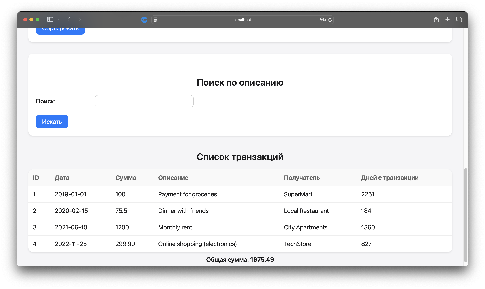
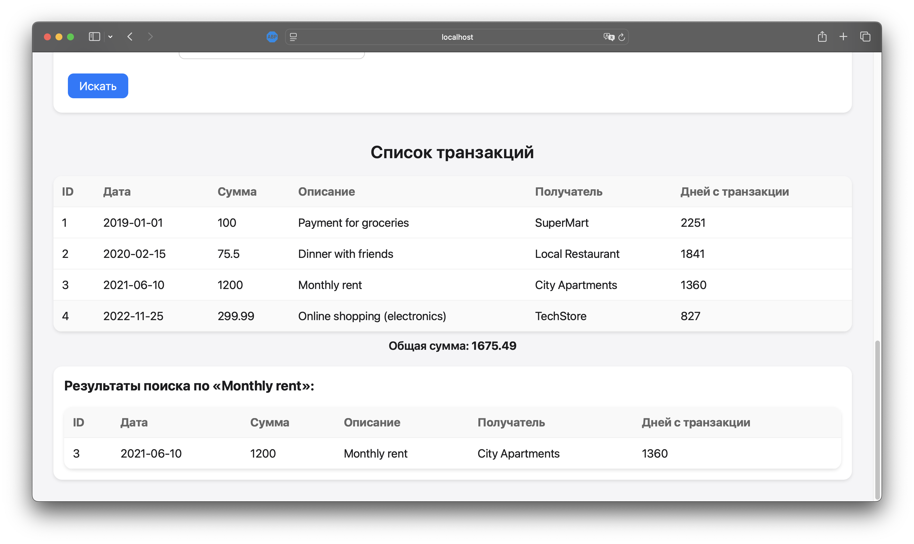
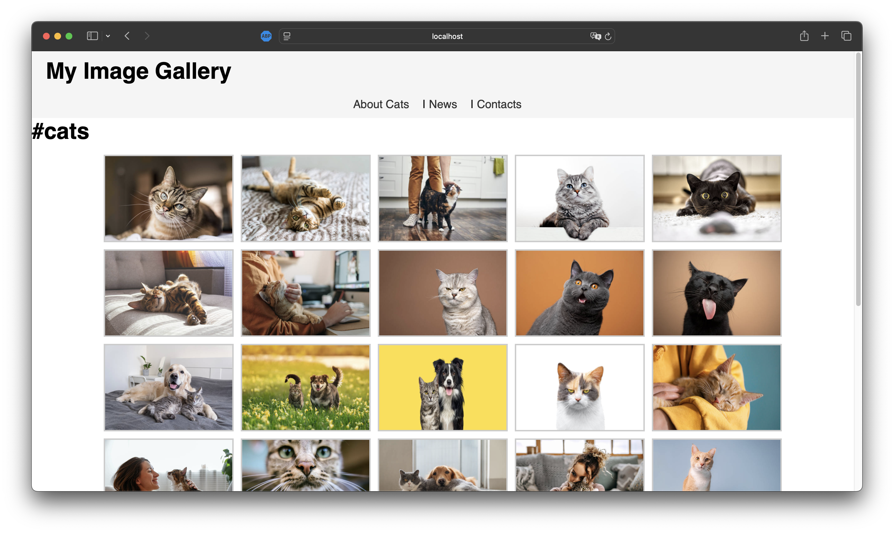

# Лабораторная работа №3: Массивы и Функции

## 🎯 Тема
Массивы и Функции в PHP

## 📝 Цель работы
В данной лабораторной работе я:

- Освою работу с массивами в PHP, выполняя операции создания, добавления, удаления, сортировки и поиска.
- Закреплю навыки работы с функциями, включая передачу аргументов, возвращаемые значения и анонимные функции.
- Реализую систему управления банковскими транзакциями через интерактивный веб-интерфейс.
- На практике изучу основы работы с файловой системой, выводя изображения в виде галереи.

---

## 📚 Условия работы

### Задание 1. Работа с массивами и функциями

**Условия:**

1. **Подготовка среды:**
   - Убедиться, что установлена версия PHP 8+.
   - Создать новый PHP-файл, например, `index.php`.
   - В начале файла включить строгую типизацию:
     ```php
     declare(strict_types=1);
     ```

2. **Создание массива транзакций:**
   - Создать массив `$transactions`, где каждая транзакция — ассоциативный массив с полями:
     - `id` – уникальный идентификатор транзакции
     - `date` – дата совершения транзакции (формат YYYY-MM-DD)
     - `amount` – сумма транзакции
     - `description` – описание назначения платежа
     - `merchant` – название организации, получившей платеж

3. **Вывод транзакций:**
   - С помощью цикла `foreach` вывести список транзакций в виде HTML-таблицы.
   - Добавить столбец, отображающий количество дней, прошедших с даты транзакции.

4. **Реализация функций:**
   - Функция для вычисления общей суммы всех транзакций.
   - Функция для поиска транзакции по части описания.
   - Функция для поиска транзакции по идентификатору (с использованием цикла `foreach` и `array_filter`).
   - Функция, возвращающая количество дней с даты транзакции.
   - Функция для добавления новой транзакции.
   - Использовать глобальную переменную `$transactions` внутри функций.

5. **Сортировка транзакций:**
   - Отсортировать транзакции по дате с помощью `usort()`.
   - Отсортировать транзакции по сумме (по убыванию) с помощью `usort()`.

### Задание 2. Работа с файловой системой

**Условия:**

1. Создать директорию `image`, поместив туда 20–30 изображений с расширением `.jpg` или `.jpeg`.
2. Создать файл, например, `gallery.php`, в котором:
   - Определить веб-страницу с хедером, меню, контентом и футером.
   - Использовать функцию `scandir()` для получения списка изображений и вывести их в виде галереи.

---

## Детальное описание реализации

### Задание 1: Система управления банковскими транзакциями

#### Шаг 1: Подготовка исходных данных
- Я создал файл **`index.php`** и включил строгую типизацию.
- В начале файла определил массив `$transactions`, содержащий несколько примеров транзакций.

#### Шаг 2: Реализация функций
- Создал функции для:
  - Добавления транзакции.
  - Удаления транзакции.
  - Сортировки по дате (возрастание) и по сумме (убывание).
  - Поиска по описанию.
  - Подсчета дней с даты транзакции.
  - Вычисления общей суммы.
- Каждая функция задокументирована в формате PHPDoc.

#### Шаг 3: Обработка форм
- Обрабатываю POST-запросы для:
  - Добавления транзакции.
  - Удаления транзакции.
  - Сортировки транзакций.
  - Поиска транзакций по описанию.

#### Шаг 4: Вывод транзакций
- В **`index.php`** размещаю HTML-формы и таблицу для вывода полного списка транзакций.  
- В таблице, помимо стандартных полей, добавлен столбец с количеством дней, прошедших с даты транзакции.

#### Шаг 5: Общая сумма
- В конце страницы вывожу итоговую сумму всех транзакций.

**Исходный код:**  
Все функции и логика управления транзакциями находятся в файле **`index.php`**.  

#### Скриншоты
1. **Скриншот интерфейса** с таблицей транзакций.  

2. **Скриншот** с результатами поиска транзакций по описанию.


---

### Задание 2: Галерея изображений

#### Шаг 1: Подготовка файловой системы
- Создал директорию **`image`**, поместив туда не менее 20 изображений в формате `.jpg`.

#### Шаг 2: Реализация галереи
- Создал файл **`gallery.php`**, где:
  - Определил структуру веб-страницы (шапка, меню, контент, подвал).
  - Использовал `scandir()` для считывания содержимого папки `image`.
  - Организовал вывод картинок в виде простой галереи (со стилями: hover-эффект, отступы и т. д.).

**Исходный код:**  
Файл со скриптом галереи хранится в **`gallery.php`**.  

#### Скриншот галереи
1. **Скриншот страницы `gallery.php`** с изображениями, размещенными в формате галереи.


---

## Контрольные вопросы

1. **Что такое массивы в PHP?**  
   Массивы — это структуры данных, позволяющие хранить набор значений, доступных по ключам (индексным или ассоциативным).

2. **Каким образом можно создать массив в PHP?**  
   - Использование квадратных скобок: `$arr = [];`  
   - Использование `array()`: `$arr = array();`

3. **Для чего используется цикл foreach?**  
   `foreach` оптимален для перебора всех элементов массива без необходимости отслеживать индексы вручную.

---

## Заключение

В ходе выполнения лабораторной работы №3 «Массивы и Функции» я:

- **Освоил работу с массивами**, научившись добавлять, удалять, искать и сортировать элементы.
- **Реализовал систему управления банковскими транзакциями** через интерактивный веб-интерфейс, включающий формы добавления и удаления транзакций, а также сортировку и поиск.
- **Научился выводить изображения из директории**, используя функцию `scandir()`, и оформлять их в виде галереи.
- **Закрепил навыки документирования кода** (PHPDoc), что повышает читаемость и удобство поддержки.
- **Проверил работу кода**, запустив встроенный PHP-сервер и протестировав все функции, убедившись в корректном выводе таблицы транзакций и галереи изображений.

Таким образом, я получил важный практический опыт в области создания и управления массивами в PHP, а также в разработке динамических веб-приложений с базовой работой с файлами.
