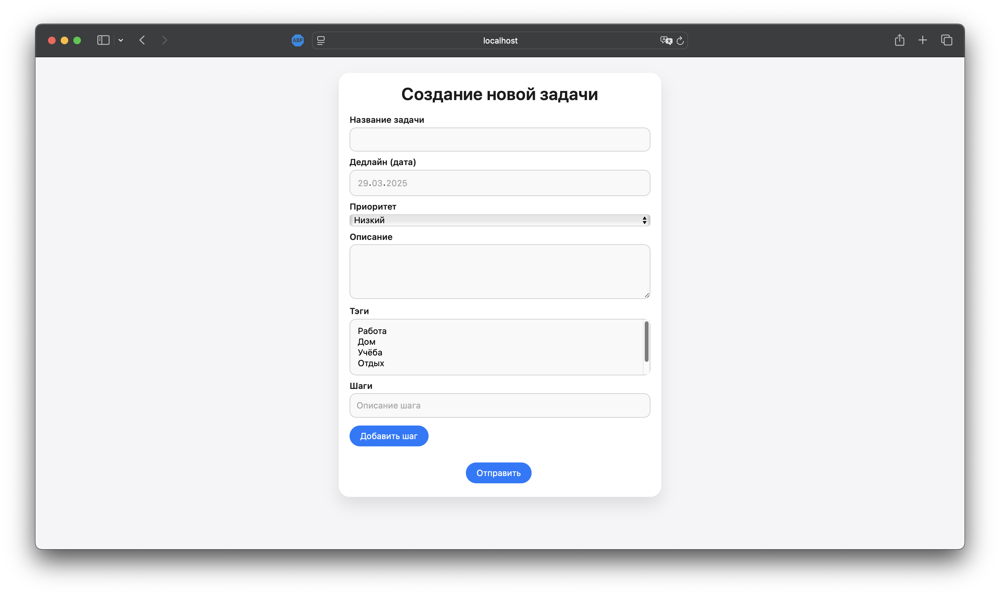
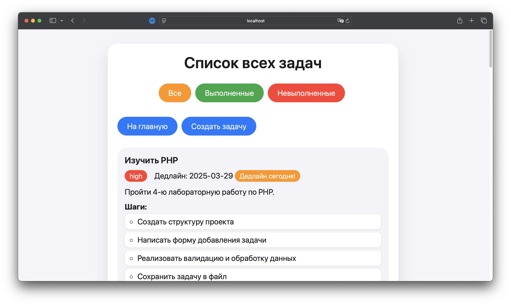

# Лабораторная работа №4: Обработка и валидация форм

---

## 🎯 Тема
Обработка и валидация форм в PHP

---

## 📝 Цель работы

Цель данной лабораторной работы — освоить ключевые аспекты работы с HTML-формами в PHP, включая отправку данных на сервер, их обработку и валидацию. В рамках работы я:

- Научился создавать и обрабатывать HTML-формы с использованием PHP.
- Освоил фильтрацию и валидацию пользовательских данных для обеспечения безопасности и корректности.
- Реализовал систему управления задачами (ToDo-лист) с сохранением данных в файл.
- Закрепил навыки структурирования проекта и использования вспомогательных функций.

Эта работа станет основой для дальнейшего изучения веб-разработки и будет развиваться в последующих лабораторных заданиях.

---

## 📚 Условия работы

### Задание 1. Создание проекта
- Создать корневую директорию проекта `lab4_lab4_todo-list`.
- Организовать логичную файловую структуру:
  ```
  lab4_todo-list/
  ├── public/
  │   ├── index.php                   # Главная страница (вывод последних задач)
  │   └── task/
  │       ├── create.php              # Форма добавления задачи
  │       └── index.php               # Страница со списком всех задач
  ├── src/
  │   ├── handlers/                   # Обработчики форм
  │   └── helpers.php                 # Вспомогательные функции
  ├── storage/
  │   └── tasks.txt                   # Файл для хранения задач
  └── README.md                       # Описание проекта
  ```

### Задание 2. Создание формы добавления задачи
- Реализовать HTML-форму в файле `public/task/create.php` с полями:
  - Название задачи (`<input type="text">`)
  - Дедлайн (`<input type="date">`)
  - Приоритет (`<select>`)
  - Описание (`<textarea>`)
  - Тэги (`<select multiple>`)
  - Шаги (динамическое добавление через JavaScript)
- Добавить кнопку "Отправить" для передачи данных на сервер.

### Задание 3. Обработка формы
- Создать обработчик в `src/handlers/create_task_handler.php`, который:
  - Фильтрует данные с использованием встроенных функций PHP.
  - Проводит валидацию введенных данных.
  - Сохраняет данные в файл `storage/tasks.txt` в формате JSON.
- При ошибках валидации отображать сообщения под соответствующими полями формы.
- После успешной обработки перенаправлять пользователя на главную страницу.

### Задание 4. Отображение задач
- На главной странице (`public/index.php`) отобразить 2 последние задачи.
- На странице `public/task/index.php` вывести все задачи с пагинацией (по 5 задач на страницу).

---

## Детальное описание шагов выполнения лабораторной работы

### Задание 1: Создание проекта

#### Шаг 1.1: Организация файловой структуры
- **Что я сделал:**  
  Создал корневую директорию `lab4_todo-list` и организовал файловую структуру, как указано в условиях.
- **Зачем:**  
  Четкая структура упрощает навигацию по проекту и поддержку кода в будущем.
- **Как:**  
  Использовал команды в терминале:
  ```bash
  mkdir -p lab4_todo-list/{public/task,src/handlers,storage}
  touch lab4_todo-list/public/index.php lab4_todo-list/public/task/create.php lab4_todo-list/public/task/index.php
  touch lab4_todo-list/src/helpers.php lab4_todo-list/src/handlers/create_task_handler.php
  touch lab4_todo-list/storage/tasks.txt lab4_todo-list/README.md
  ```

#### Шаг 1.2: Настройка окружения
- **Что я сделал:**  
  Убедился, что PHP версии 8+ установлен, и запустил встроенный сервер для тестирования.
- **Как:**  
  Проверил версию PHP командой `php -v` и запустил сервер:
  ```bash
  cd lab4_lab4_todo-list
  php -S localhost:8080
  ```

---

### Задание 2: Создание формы добавления задачи

#### Шаг 2.1: Разработка HTML-формы
- **Что я сделал:**  
  В файле `public/task/create.php` создал форму с необходимыми полями.
- **Как:**  
  Использовал HTML-теги `<form>`, `<input>`, `<select>` и `<textarea>`, добавив стили для улучшения внешнего вида.
- **Код формы:**
  ```html
  <form action="../../src/handlers/create_task_handler.php" method="POST">
      <label for="title">Название задачи:</label>
      <input type="text" id="title" name="title" required>
      
      <label for="due_date">Дедлайн:</label>
      <input type="date" id="due_date" name="due_date" required>
      
      <label for="priority">Приоритет:</label>
      <select id="priority" name="priority" required>
          <option value="low">Низкий</option>
          <option value="medium">Средний</option>
          <option value="high">Высокий</option>
      </select>
      
      <label for="description">Описание:</label>
      <textarea id="description" name="description" rows="4"></textarea>
      
      <label for="tags">Тэги:</label>
      <select id="tags" name="tags[]" multiple>
          <option value="work">Работа</option>
          <option value="personal">Личное</option>
          <option value="urgent">Срочно</option>
      </select>
      
      <label>Шаги:</label>
      <div id="steps-container"></div>
      <button type="button" onclick="addStep()">Добавить шаг</button>
      
      <button type="submit">Отправить</button>
  </form>
  ```

#### Шаг 2.2: Динамическое добавление шагов
- **Что я сделал:**  
  Реализовал динамическое добавление полей для шагов с помощью JavaScript.
- **Как:**  
  Добавил функцию `addStep()`, которая создает новые поля `<input>` при нажатии кнопки.
- **Код JavaScript:**
  ```javascript
  function addStep() {
      const container = document.getElementById('steps-container');
      const newInput = document.createElement('input');
      newInput.type = 'text';
      newInput.name = 'steps[]';
      newInput.placeholder = 'Введите шаг';
      container.appendChild(newInput);
  }
  ```

---

### Задание 3: Обработка формы

#### Шаг 3.1: Фильтрация и валидация данных
- **Что я сделал:**  
  В файле `src/handlers/create_task_handler.php` настроил фильтрацию и валидацию данных формы.
- **Как:**  
  Использовал `filter_input_array` для фильтрации и проверку на пустые обязательные поля.
- **Код:**
  ```php
  $filters = [
      'title' => FILTER_SANITIZE_STRING,
      'due_date' => FILTER_SANITIZE_STRING,
      'priority' => FILTER_SANITIZE_STRING,
      'description' => FILTER_SANITIZE_STRING,
  ];
  $filteredInput = filter_input_array(INPUT_POST, $filters);
  $tags = isset($_POST['tags']) ? (array)$_POST['tags'] : [];
  $steps = isset($_POST['steps']) ? (array)$_POST['steps'] : [];
  $errors = [];

  if (empty($filteredInput['title'])) {
      $errors['title'] = 'Пожалуйста, введите название задачи.';
  }
  if (empty($filteredInput['due_date'])) {
      $errors['due_date'] = 'Пожалуйста, укажите дедлайн.';
  }
  ```

#### Шаг 3.2: Сохранение данных
- **Что я сделал:**  
  После успешной валидации сохранил данные задачи в файл `tasks.txt` в формате JSON.
- **Как:**  
  Использовал `file_put_contents` с флагом `FILE_APPEND` для добавления новой строки.
- **Код:**
  ```php
  if (empty($errors)) {
      $taskData = [
          'id' => uniqid(),
          'title' => $filteredInput['title'],
          'due_date' => $filteredInput['due_date'],
          'priority' => $filteredInput['priority'],
          'description' => $filteredInput['description'],
          'tags' => $tags,
          'steps' => $steps,
      ];
      $storageFile = __DIR__ . '/../../storage/tasks.txt';
      file_put_contents($storageFile, json_encode($taskData) . PHP_EOL, FILE_APPEND);
      header('Location: /public/index.php');
      exit;
  }
  ```

#### Шаг 3.3: Обработка ошибок
- **Что я сделал:**  
  При наличии ошибок перенаправил пользователя обратно на форму с сохранением введенных данных и отображением ошибок.
- **Как:**  
  Использовал GET-параметры для передачи ошибок и старых значений.
- **Код:**
  ```php
  $errorsEncoded = urlencode(json_encode($errors));
  $oldEncoded = urlencode(json_encode($filteredInput));
  header("Location: /public/task/create.php?errors={$errorsEncoded}&old={$oldEncoded}");
  exit;
  ```

---

### Задание 4: Отображение задач

#### Шаг 4.1: Главная страница (2 последние задачи)
- **Что я сделал:**  
  В файле `public/index.php` отобразил две последние задачи из файла `tasks.txt`.
- **Как:**  
  Считал строки файла, преобразовал их в массив и выбрал последние элементы с помощью `array_slice`.
- **Код:**
  ```php
  $storageFile = __DIR__ . '/../storage/tasks.txt';
  $tasks = file_exists($storageFile) ? array_map('json_decode', file($storageFile, FILE_IGNORE_NEW_LINES)) : [];
  $latestTasks = array_slice($tasks, -2);
  foreach ($latestTasks as $task) {
      echo "<h3>{$task->title}</h3>";
      echo "<p>Дедлайн: {$task->due_date}</p>";
  }
  ```

#### Шаг 4.2: Страница со всеми задачами и пагинацией
- **Что я сделал:**  
  В файле `public/task/index.php` реализовал вывод всех задач с пагинацией.
- **Как:**  
  Использовал GET-параметр `page` для определения текущей страницы и `array_slice` для выборки задач.
- **Код:**
  ```php
  $tasksPerPage = 5;
  $page = isset($_GET['page']) ? (int)$_GET['page'] : 1;
  $offset = ($page - 1) * $tasksPerPage;
  $tasks = array_map('json_decode', file($storageFile, FILE_IGNORE_NEW_LINES));
  $currentTasks = array_slice($tasks, $offset, $tasksPerPage);
  foreach ($currentTasks as $task) {
      echo "<h3>{$task->title}</h3>";
      echo "<p>Дедлайн: {$task->due_date}</p>";
  }
  $totalPages = ceil(count($tasks) / $tasksPerPage);
  for ($i = 1; $i <= $totalPages; $i++) {
      echo "<a href='index.php?page={$i}'>{$i}</a> ";
  }
  ```

---

## Исходные коды

### Файл: `public/task/create.php`
```html
<!DOCTYPE html>
<html lang="ru">
<head>
    <meta charset="UTF-8">
    <title>Создать задачу</title>
    <style>
        .container { max-width: 600px; margin: 20px auto; }
        label { display: block; margin: 10px 0 5px; }
        input, select, textarea { width: 100%; padding: 8px; }
        .error { color: red; font-size: 0.9em; }
    </style>
    <script>
        function addStep() {
            const container = document.getElementById('steps-container');
            const newInput = document.createElement('input');
            newInput.type = 'text';
            newInput.name = 'steps[]';
            newInput.placeholder = 'Введите шаг';
            container.appendChild(newInput);
        }
    </script>
</head>
<body>
<div class="container">
    <h1>Создание новой задачи</h1>
    <?php
    $errors = isset($_GET['errors']) ? json_decode(urldecode($_GET['errors']), true) : [];
    $old = isset($_GET['old']) ? json_decode(urldecode($_GET['old']), true) : [];
    ?>
    <form action="../../src/handlers/create_task_handler.php" method="POST">
        <label for="title">Название задачи:</label>
        <input type="text" id="title" name="title" value="<?php echo $old['title'] ?? ''; ?>" required>
        <?php if (isset($errors['title'])) echo "<p class='error'>{$errors['title']}</p>"; ?>

        <label for="due_date">Дедлайн:</label>
        <input type="date" id="due_date" name="due_date" value="<?php echo $old['due_date'] ?? ''; ?>" required>
        <?php if (isset($errors['due_date'])) echo "<p class='error'>{$errors['due_date']}</p>"; ?>

        <label for="priority">Приоритет:</label>
        <select id="priority" name="priority" required>
            <option value="low">Низкий</option>
            <option value="medium">Средний</option>
            <option value="high">Высокий</option>
        </select>

        <label for="description">Описание:</label>
        <textarea id="description" name="description" rows="4"><?php echo $old['description'] ?? ''; ?></textarea>

        <label for="tags">Тэги:</label>
        <select id="tags" name="tags[]" multiple>
            <option value="work">Работа</option>
            <option value="personal">Личное</option>
            <option value="urgent">Срочно</option>
        </select>

        <label>Шаги:</label>
        <div id="steps-container"></div>
        <button type="button" onclick="addStep()">Добавить шаг</button>

        <button type="submit">Отправить</button>
    </form>
</div>
</body>
</html>
```

### Файл: `src/handlers/create_task_handler.php`
```php
<?php
require_once __DIR__ . '/../helpers.php';

if ($_SERVER['REQUEST_METHOD'] === 'POST') {
    $filters = [
        'title' => FILTER_SANITIZE_STRING,
        'due_date' => FILTER_SANITIZE_STRING,
        'priority' => FILTER_SANITIZE_STRING,
        'description' => FILTER_SANITIZE_STRING,
    ];
    $filteredInput = filter_input_array(INPUT_POST, $filters);
    $tags = isset($_POST['tags']) ? (array)$_POST['tags'] : [];
    $steps = isset($_POST['steps']) ? (array)$_POST['steps'] : [];
    $errors = [];

    if (empty($filteredInput['title'])) {
        $errors['title'] = 'Пожалуйста, введите название задачи.';
    }
    if (empty($filteredInput['due_date'])) {
        $errors['due_date'] = 'Пожалуйста, укажите дедлайн.';
    }

    if (!empty($errors)) {
        $oldValues = $filteredInput;
        $errorsEncoded = urlencode(json_encode($errors));
        $oldEncoded = urlencode(json_encode($oldValues));
        header("Location: /public/task/create.php?errors={$errorsEncoded}&old={$oldEncoded}");
        exit;
    }

    $taskData = [
        'id' => uniqid(),
        'title' => $filteredInput['title'],
        'due_date' => $filteredInput['due_date'],
        'priority' => $filteredInput['priority'],
        'description' => $filteredInput['description'],
        'tags' => $tags,
        'steps' => $steps,
    ];
    $storageFile = __DIR__ . '/../../storage/tasks.txt';
    file_put_contents($storageFile, json_encode($taskData) . PHP_EOL, FILE_APPEND);
    header('Location: /public/index.php');
    exit;
}
```

---

## Скриншоты

1. **Форма добавления задачи**  
     
   *Описание: Форма с полями для ввода данных задачи и динамическим добавлением шагов.*

2. **Список всех задач с пагинацией**  
     
   *Описание: Страница со всеми задачами и навигацией по страницам.*

---

## Заключение

В ходе выполнения лабораторной работы №4 я:

- **Освоил работу с HTML-формами в PHP**, научившись отправлять данные на сервер и обрабатывать их.
- **Реализовал фильтрацию и валидацию данных**, обеспечив безопасность и корректность ввода.
- **Создал систему управления задачами (ToDo-лист)** с динамической формой, сохранением данных в файл и отображением с пагинацией.
- **Закрепил навыки работы с файловой системой**, используя JSON для хранения данных.
- **Улучшил организацию проекта**, применив логичную структуру и вспомогательные функции.

Эта работа заложила фундамент для дальнейшего изучения веб-разработки, и я планирую развивать проект в следующих заданиях.

---

## Контрольные вопросы

### 1. Какие методы HTTP применяются для отправки данных формы?
- **GET**: Передает данные через URL. Используется для запросов, не изменяющих состояние сервера (например, поиск).
- **POST**: Передает данные в теле запроса. Подходит для отправки больших объемов данных и изменения состояния сервера (например, создание задачи).

### 2. Что такое валидация данных, и чем она отличается от фильтрации?
- **Валидация**: Проверка данных на соответствие требованиям (например, обязательное поле, корректный формат даты).
- **Фильтрация**: Очистка данных от нежелательных символов или преобразование их в безопасный вид (например, удаление тегов с помощью `strip_tags`).
- **Разница**: Валидация определяет, правильны ли данные, а фильтрация подготавливает их к обработке.

### 3. Какие функции PHP используются для фильтрации данных?
- `filter_input` и `filter_var` — фильтрация отдельных значений.
- `filter_input_array` — фильтрация массива данных (например, `$_POST`).
- `strip_tags` — удаление HTML-тегов.
- `htmlspecialchars` — экранирование специальных символов.
- `trim` — удаление пробелов в начале и конце строки.
