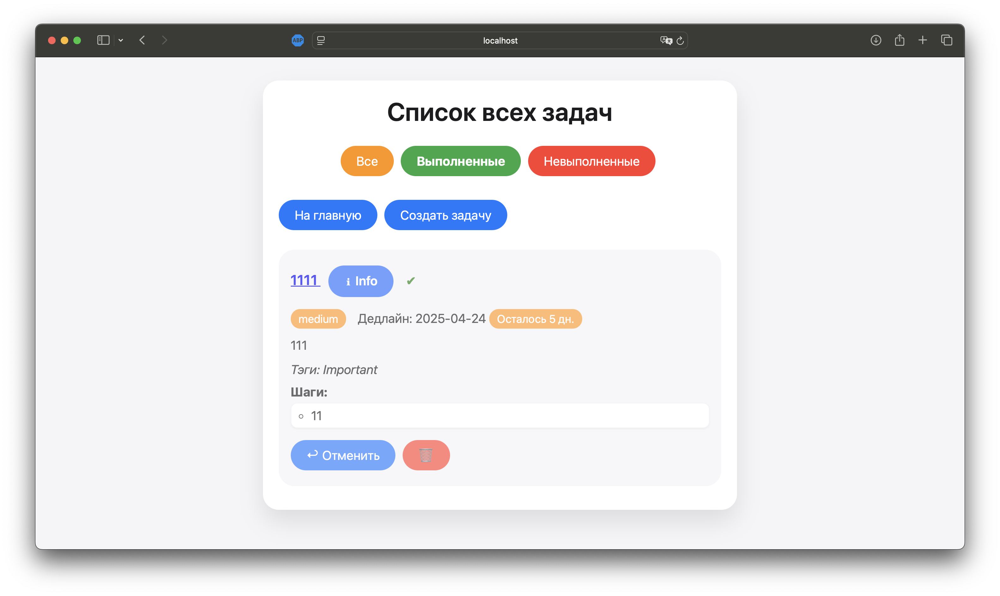

# 📒 Лабораторная работа № 5
**«Архитектура с Front-Controller и MySQL-хранилищем для приложения "To-Do List"»**

> *Работа выполнена на основе методических указаний «recipe-book», но адаптирована под тематику списка задач.*

---

## ⏱️ Быстрый старт

```bash
# 1. Клонируем репозиторий
git clone https://github.com/NikitaBytes/lab5_todo-list.git
cd lab5_todo-list

# 2. Устанавливаем зависимости
composer install            # vlucas/phpdotenv

# 3. Конфигурируем базу (.env)
cp .env.sample .env        # и правим DB_HOST, DB_NAME,…

# 4. Поднимаем MySQL и применяем миграции
mysql < migrations/001_create_tables.sql

# 5. Запускаем встроенный PHP-сервер
php -S localhost:8080 -t public
```

*Откройте `http://localhost:8080` — появится главная страница со списком последних задач.*

---

## 📚 Содержание

1.  [Постановка задачи](#quickstart)
2.  [Архитектура проекта](#architecture)
3.  [Краткая документация](#documentation)
4.  [Примеры использования](#examples)
5.  [Конфигурация и База данных](#config-db)
6.  [Контрольные вопросы](#qa)
7.  [Использованные источники](#references)
8.  [Дополнительные аспекты](#extras)

---
<a id="quickstart"></a>
## 🎯 Постановка задачи

Необходимо:

*   Перейти от файлового хранения (`tasks.txt`) к **MySQL**.
*   Реализовать **Front-Controller** (`public/index.php`) и минималистичный **Router**.
*   Настроить **шаблонизацию** (layout + views).
*   Покрыть приложение полным **CRUD**-циклом, **валидацией**, защитой от **SQL-инъекций**.
*   Вывести задачи **постранично** (SQL `LIMIT` / `OFFSET`).
*   Оформить код **PHPDoc / JSDoc** и сохранить стилистику **неоморфного UI** из ЛР-4.

---
<a id="architecture"></a>
## 🏗️ Архитектура проекта

```plaintext
todo-list/
├── public/                # Точка входа + статика
│   ├── index.php          # Front-Controller: инициализирует приложение и вызывает Router
│   └── css/style.css      # Стили неоморфизма
├── src/
│   ├── bootstrap.php      # Инициализация: .env, автозагрузка, кодировка, регистрация маршрутов
│   ├── core/              # Ядро приложения (инфраструктурные компоненты)
│   │   ├── Database.php   # PDO-singleton: обеспечивает единственное подключение к БД
│   │   ├── Router.php     # Минималистичный маршрутизатор: сопоставляет URL и HTTP-метод с обработчиком
│   │   └── View.php       # Простой рендерер: подключает шаблон контента внутрь базового layout
│   ├── handlers/Task/     # Обработчики запросов (контроллеры) для сущности Task
│   │   │                  # Каждый класс реализует один метод handle() (Single Action Controller)
│   │   ├── Index.php      # Главная страница (последние 2 задачи)
│   │   ├── ListTasks.php  # Список всех задач с пагинацией и фильтрами
│   │   ├── Show.php       # Просмотр деталей одной задачи
│   │   ├── CreateForm.php # Отображение формы создания (GET)
│   │   ├── Create.php     # Обработка формы создания (POST), валидация, вставка в БД
│   │   ├── EditForm.php   # Отображение формы редактирования (GET)
│   │   ├── Edit.php       # Обработка формы редактирования (POST), валидация, обновление БД
│   │   ├── Toggle.php     # Переключение статуса 'completed' (AJAX POST)
│   │   └── Delete.php     # Удаление задачи (POST)
│   ├── helpers.php        # Вспомогательные функции (например, getDeadlineInfo)
│   └── models/            # (Зарезервировано) Место для классов моделей/сущностей/DAO
├── templates/             # Шаблоны представлений (PHP-файлы)
│   ├── layout.php         # Базовый HTML-макет страницы
│   ├── index.php          # Шаблон главной страницы
│   └── task/              # Шаблоны для задач
│       ├── create.php     # Форма создания
│       ├── edit.php       # Форма редактирования
│       ├── index.php      # Список задач (с JS для AJAX)
│       └── show.php       # Детальный просмотр задачи
├── migrations/            # Файлы миграций базы данных
│   └── 001_create_tables.sql # SQL-скрипт для создания таблиц categories и tasks
├── config/db.php          # Конфигурация БД (читает из .env)
├── composer.json          # Конфигурация Composer (зависимости, автозагрузка PSR-4)
├── .env                   # Локальные переменные окружения (данные БД и т.д.) - НЕ КОММИТИТЬ
└── .env.example           # Пример файла .env
```

---
<a id="documentation"></a>
## 📄 Краткая документация

| Слой        | Файл / Класс        | Назначение                                                                                                |
| :---------- | :------------------ | :-------------------------------------------------------------------------------------------------------- |
| **Entry**   | `public/index.php`  | Front Controller: точка входа, инициализация, вызов `Router::dispatch`.                                   |
| **Bootstrap**| `src/bootstrap.php` | Загрузка `.env`, установка кодировки, подключение `helpers.php`, регистрация всех маршрутов приложения.     |
| **Core**    | `Database`          | Возвращает Singleton-PDO (`ERRMODE = EXCEPTION`, UTF-8), использует конфиг из `config/db.php`.             |
|             | `Router`            | Простая регистрация маршрутов `Router::get/post($uri, $callable)` и диспетчеризация `dispatch($method, $uri)`. |
|             | `View`              | `render($tpl, $data)` → рендерит `$tpl.php` внутри `layout.php`, передавая `$data` в шаблон.              |
| **Handlers**| `Task\*`            | Single-action-контроллеры (SRP, метод `handle()`). Получают данные из запроса, работают с БД, вызывают `View`. |
|             |                     | Обработчики `Create` и `Edit` содержат логику **валидации** данных формы перед записью в БД.                |
| **Helpers** | `helpers.php`       | Содержит глобально доступные вспомогательные функции, например `getDeadlineInfo()` для форматирования дедлайна. |
| **Templates**| `templates/**/*.php`| PHP-файлы для генерации HTML. Используют `$data` из `View::render`.                                        |
| **Database**| `migrations/*.sql`  | SQL-скрипты для создания/изменения структуры БД. Таблица `tasks` использует **JSON** поля для `tags` и `steps`. |
| **Config**  | `.env`, `config/db.php`| Управление конфигурацией БД через переменные окружения.                                                   |
| **CSS**     | `style.css`         | Неоморфные карточки, капсулы приоритета/категории/дедлайна, адаптивные стили для форм.                     |
| **JS**      | *в views*           | Встроенный JS (IIFE): динамическое добавление полей (шаги), **AJAX**-запрос для переключения статуса задачи. |

### Пример подготовленного выражения (защита SQLi)

```php
/** Toggle completed (AJAX) */
$stmt = $pdo->prepare('UPDATE tasks SET completed = NOT completed WHERE id = :id');
$stmt->execute([':id' => (int)$id]);
```

### Пагинация

```php
$limit  = 5;
$offset = ($page - 1) * $limit;

// Получаем порцию данных + общее количество строк (для пагинации)
$stmt = $pdo->prepare(
    "SELECT SQL_CALC_FOUND_ROWS t.*, c.name AS category
     FROM tasks t LEFT JOIN categories c ON c.id = t.category_id
     $where ORDER BY t.id DESC
     LIMIT :limit OFFSET :offset"
);
// Безопасно подставляем параметры
$stmt->bindValue(':limit',  $limit , PDO::PARAM_INT);
$stmt->bindValue(':offset', $offset, PDO::PARAM_INT);
$stmt->execute();
$tasks = $stmt->fetchAll();

// Получаем общее количество строк (найденных предыдущим запросом)
$totalRows = $pdo->query('SELECT FOUND_ROWS()')->fetchColumn();
$totalPages = ceil($totalRows / $limit);
```

---
<a id="examples"></a>
## ✨ Примеры использования

**1. Главная страница (`/`)**
     * Отображает последние 2 добавленные задачи для быстрого обзора.

**2. Форма создания (`/task/create`)**
     * Позволяет ввести заголовок, описание, выбрать категорию (загружается из БД), приоритет, дату.
     * Динамическое добавление/удаление полей для тегов и шагов с помощью JavaScript.
     * Валидация данных на стороне сервера (обязательность полей, форматы, длины). При ошибках форма отображается снова с сообщениями и введенными значениями.

**3. Список всех задач (`/task/index`)**
     * Отображает задачи постранично (по 5 штук).
     * Фильтры по статусу: `all` / `completed` / `incomplete`.
     * Визуальные индикаторы: капсулы приоритета, дедлайна (с расчетом оставшихся дней), категории.
     * **AJAX-кнопка «✔ Выполнить / ↩ Отменить»**: изменяет статус задачи без перезагрузки страницы, отправляя POST-запрос на `/task/toggle`.
     * Кнопки для просмотра деталей (`/task/show?id=...`) и удаления (`/task/delete`).

**4. Подробный просмотр (`GET /task/show?id=...`)**
     * Отображает всю информацию о задаче: заголовок, описание, категорию, приоритет, дедлайн, теги (списком), шаги (нумерованным списком).
     * Кнопки: `Edit` (переход на `/task/edit?id=...`) / `Delete` (отправка POST на `/task/delete`).

**5. Редактирование задачи (`GET /task/edit?id=...`, `POST /task/edit`)**
     * Форма, аналогичная форме создания, но предзаполненная данными существующей задачи.
     * При отправке (POST) данные валидируются и обновляются в БД.

---
<a id="config-db"></a>
## ⚙️ Конфигурация и База данных

*   **Переменные окружения**: Основные параметры (БД, ...) задаются в файле `.env`. Скопируйте `.env.example` в `.env` и укажите свои значения. Библиотека `vlucas/phpdotenv` загружает эти переменные.
*   **Конфигурация БД**: Файл `config/db.php` читает переменные окружения (`$_ENV`) и возвращает массив с параметрами для PDO.
*   **Миграции**: Структура базы данных описана в `migrations/001_create_tables.sql`. Для инициализации базы выполните этот скрипт (например, через `mysql < migrations/001_create_tables.sql`).
    *   **Таблица `categories`**: Хранит категории задач (`id`, `name`).
    *   **Таблица `tasks`**: Основная таблица задач со связью `FOREIGN KEY` к `categories`. Поля `tags` и `steps` имеют тип `JSON` для хранения массивов строк.

---
<a id="qa"></a>
## 🤔 Контрольные вопросы

| № | Вопрос                                        | Ответ                                                                                                                               |
| :-: | :-------------------------------------------- | :---------------------------------------------------------------------------------------------------------------------------------- |
| 1 | Какие преимущества даёт использование единой точки входа в веб-приложении? | Front Controller (единая точка входа) обеспечивает централизованную обработку всех HTTP-запросов через index.php. Это позволяет: <br>- Инициализировать окружение приложения один раз для всех запросов<br>- Применять единую логику безопасности и аутентификации<br>- Централизованно обрабатывать ошибки и исключения<br>- Упростить маршрутизацию запросов к обработчикам<br>- Добавлять промежуточное ПО (middleware)<br>- Контролировать полный жизненный цикл запроса<br>- Упростить развертывание и обслуживание приложения |
| 2 | Какие преимущества даёт использование шаблонов? | Шаблоны (templates) предоставляют следующие преимущества:<br>- Отделение логики от представления (разделение ответственности)<br>- Возможность повторного использования HTML-структур<br>- Упрощение поддержки и изменения дизайна<br>- Уменьшение дублирования кода<br>- Более чистый и понятный код представления<br>- Возможность работы дизайнерам без знания PHP<br>- Легкость локализации интерфейса |
| 3 | Какие преимущества даёт хранение данных в базе по сравнению с хранением в файлах? | База данных предоставляет множество преимуществ:<br>- Поддержка ACID-транзакций для целостности данных<br>- Параллельный доступ множества пользователей<br>- Индексирование для быстрого поиска<br>- Сложные SQL-запросы и JOIN-ы между таблицами<br>- Встроенные механизмы резервного копирования<br>- Контроль целостности через внешние ключи<br>- Эффективная работа с большими объемами данных<br>- Управление правами доступа |
| 4 | Что такое SQL-инъекция? Придумайте пример SQL-инъекции и объясните, как её предотвратить. | SQL-инъекция - это атака, при которой вредоносный SQL-код внедряется через пользовательский ввод. Предотвращение:<br>- Использование подготовленных выражений (prepared statements)<br>- Параметризация всех пользовательских данных<br>- Валидация типов и форматов входных данных<br>- Минимизация привилегий БД-пользователя<br>- Экранирование специальных символов<br>- Использование ORM или Query Builder |
| 5 | Пример инъекции | Уязвимый код: `$sql = "SELECT * FROM users WHERE name = '$input'"`. При вводе `' OR '1'='1` получим:<br>`SELECT * FROM users WHERE name = '' OR '1'='1'`<br>Это вернет все записи из таблицы. Безопасный вариант:<br>`$stmt = $pdo->prepare("SELECT * FROM users WHERE name = ?");`<br>`$stmt->execute([$input]);` |
| 6 | `LIMIT` / `OFFSET`? | LIMIT и OFFSET в SQL используются для пагинации:<br>- LIMIT определяет максимальное количество возвращаемых строк<br>- OFFSET указывает, сколько строк пропустить<br>Пример: `LIMIT 10 OFFSET 30` вернет строки 31-40<br>Преимущества:<br>- Снижение нагрузки на БД и сеть<br>- Улучшение пользовательского опыта<br>- Эффективная работа с большими наборами данных |

---
<a id="references"></a>
## 📚 Использованные источники

*   PHP Manual — PDO, `filter_var`, `DateTimeImmutable`, `json_encode`/`decode`.
*   PSR-4 Autoloader, PSR-12 Coding Style Guide.
*   `vlucas/phpdotenv` — документация библиотеки.
*   MDN Web Docs — Fetch API, FormData, HTML5 Forms.
*   Статьи о паттерне Front Controller, Dependency Injection (хотя здесь используется Singleton для PDO), защите от SQL-инъекций (Prepared Statements).
*   Принципы REST (для структуры URL и методов HTTP).

---

## Интерфейс


<a id="extras"></a>
## 🚀 Дополнительные аспекты

*   **Расширяемость**: Структура `src/handlers/` и `src/core/` позволяет легко добавлять новые сущности и функциональность. В `src/models/` предусмотрена точка роста для DAO/Repository классов.
*   **PSR-4 Autoloading**: Composer управляет автозагрузкой классов, что упрощает структуру `require` и управление зависимостями.
*   **i18n-ready**: Текстовые строки в основном сосредоточены в `templates`, что упрощает локализацию. Логика вынесена в `handlers`.
*   **Accessibility**: Базовая доступность учтена: использование семантических тегов, `label for` в формах, контрастные цвета (в рамках неоморфного дизайна), видимые фокус-стили для интерактивных элементов.
*   **Безопасность**: Используются подготовленные выражения PDO для защиты от SQL-инъекций. Вывод данных в HTML экранируется с помощью `htmlspecialchars`.
*   **Простота**: Ядро (`core`) содержит минимально необходимые компоненты без излишней сложности.

---